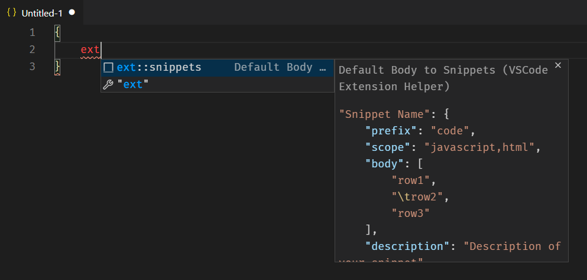
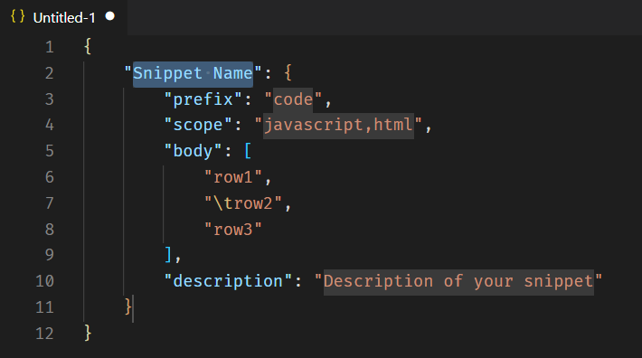
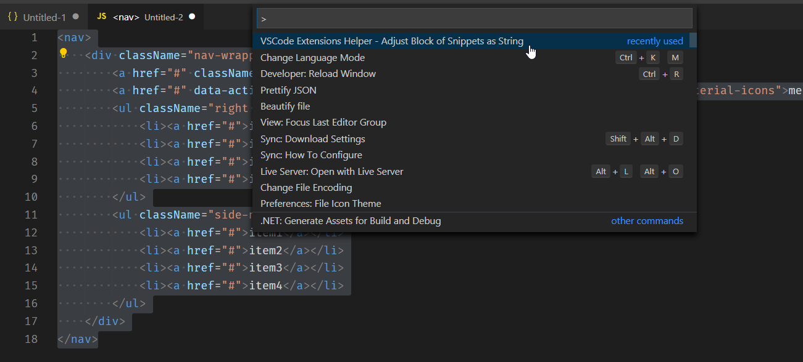
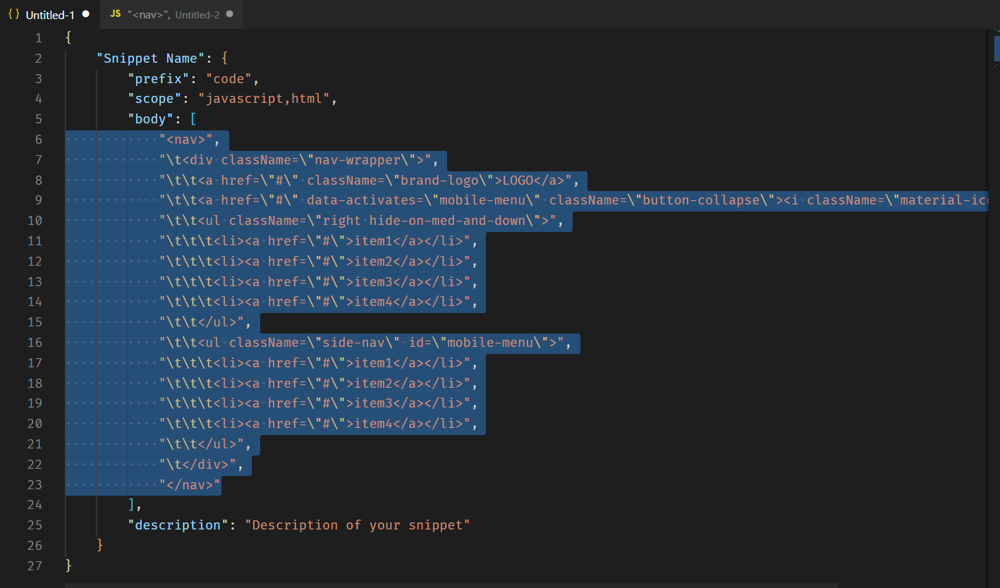

# VSCode Extensions Helper

## Helper to create snippets to VSCode Extensions

 

## Snippets

COMMAND                             | ACTION
------------------------------------|-------------------------------------------
<kbd>ext::snippets</kbd>            |  `Default body of Snippets`

 

 
 

## Formatting code to string between double quotes

* Use indentation with 4 spaces

 
 

### Make a donation

PayPal                 | PicPay
---------------------- | -------------------
 | 

#### Picpay

Não tem PicPay ainda - Cadastrando-se com o código de indicação ([6YHQJQ](http://www.picpay.com/convite?6YHQJQ)) você ganha R$ 10,00 de volta (cashback) após sua primeira compra. [Download](http://www.picpay.com/convite?6YHQJQ)

Don't have PicPay yet - Registering with the referral code ([6YHQJQ](http://www.picpay.com/convite?6YHQJQ)) you get R$ 10.00 back (cashback) after your first purchase. [Download](http://www.picpay.com/convite?6YHQJQ)

 

### Enjoy it!
